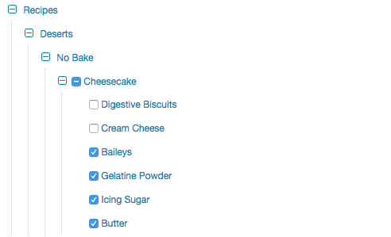

# tree-browser
A typescript library to generate an interactive tree browser

### Installation
```
npm install tree-browser --save
```

### Screenshot



### Example
To run the included example simply:
```
cd example
npm run start
```